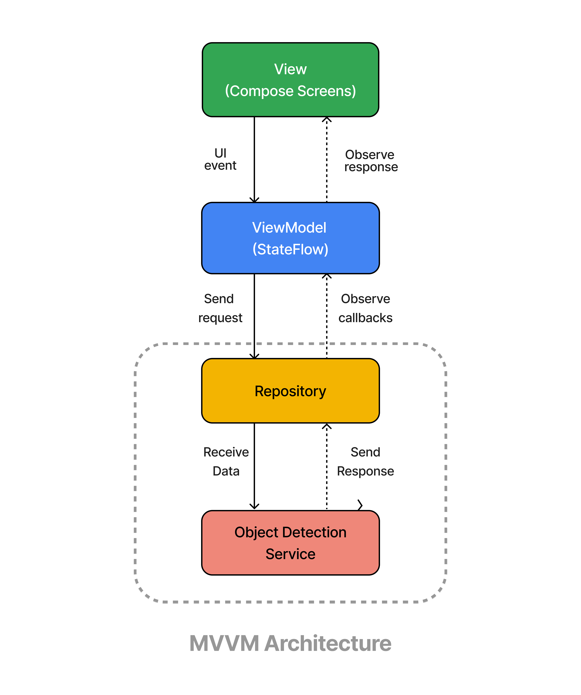

# Android Object Detection

An Android application for object detection on selected images using TensorFlow Lite. Built with modern Android development practices and Material 3 design principles, the app provides an intuitive interface for detecting objects in images.

## Demo

[Watch Demo Video](https://youtube.com/shorts/HNj1YM7kkMg?feature=share)

## Tech Stack

- **Language:** Kotlin
- **UI Framework:** Jetpack Compose
- **Architecture:** MVVM (Model-View-ViewModel)
- **Dependency Injection:** Dagger-Hilt
- **Concurrency:** Kotlin Coroutines
- **Machine Learning:** TensorFlow Lite (SSD MobileNet V1)
- **Design System:** Material 3

## Setup and Installation

1. Clone the repository: 
    ```bash
       git clone https://github.com/ArjunJadeja/object_detection
    ```
2. Open the project in Android Studio
3. Build and run the application

## How It Works

1. **Image Selection**: Choose an image from your device gallery.

2. **Image Processing**: The selected image is processed and prepared for the TensorFlow Lite model (SSD MobileNet V1).

3. **Object Detection**: The TensorFlow Lite model analyzes the processed image and identifies objects within it.

4. **Result Display**: Detection results are displayed showing bounding boxes and labels for detected objects.

## App Architecture
MVVM architecture and the Repository pattern.
<p float="left">
   
</p>

The project follows MVVM architecture:

- **Data Layer**: `MainRepository` and `ObjectDetectionService` handle image bitmap operations
- **DI**: Dagger-Hilt manages dependency injection through `ApplicationModule`
- **ViewModel**: Manages UI state and logic
- **UI Layer**: Compose-based UI with separate screens for home and object detection

## App Structure

```
├── data
│   ├── MainRepository.kt
│   └── ObjectDetectionService.kt
├── di
│   └── ApplicationModule.kt
├── ui
│   ├── MainActivity.kt
│   ├── MainViewModel.kt
│   ├── base
│   │   ├── AppNavigation.kt
│   │   ├── Dimens.kt
│   │   ├── Strings.kt
│   │   └── UiState.kt
│   ├── screens
│   │   ├── HomeScreen.kt
│   │   └── ObjectDetectionScreen.kt
│   └── theme
│       ├── Color.kt
│       ├── Theme.kt
│       └── Type.kt
└── App.kt
```